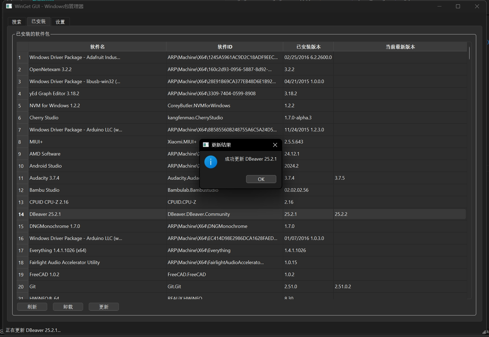

# WinGetGUI - Windows 包管理器图形界面

基于 [PySide6](https://wiki.qt.io/Qt_for_Python) 开发的 Windows 包管理器（winget）图形界面。通过类似应用商店的界面管理 Windows 软件——搜索、安装、卸载、更新软件包，操作直观便捷。


## 功能特性

- **搜索软件包** -- 在 winget 仓库中搜索软件，实时显示搜索结果
- **安装软件包** -- 单击安装软件，提供进度反馈和确认对话框
- **查看已安装软件** -- 以可排序表格形式浏览所有已安装软件，显示软件名、ID、已安装版本、可更新版本
- **卸载软件包** -- 通过界面卸载已安装软件，提供安全确认
- **更新软件包** -- 使用 winget upgrade 命令将软件更新到最新版本
- **软件详情查看** -- 查看软件详细信息，包括名称、版本、发布者、ID、描述
- **WinGet 可用性检测** -- 启动时自动检测 winget 是否已安装，提供友好错误提示
- **中文界面** -- 完整中文界面，原生用户友好
- **多线程操作** -- 所有 winget 操作在后台线程执行，界面保持响应
- **超时保护** -- 查询操作 30 秒超时，安装/卸载/更新操作 300 秒超时

## 界面截图

| 已安装软件 | 搜索软件 |
|:---------:|:-------:|
|  |  |

| 软件信息 | 更新软件 |
|:-------:|:-------:|
|  |  |

## 系统要求

- Windows 10/11
- [Windows 包管理器 (winget)](https://docs.microsoft.com/zh-cn/windows/package-manager/winget/) 已安装
- Python 3.7+

## 安装方式

### 方式一：通过 PyPI 安装（推荐）

```bash
pip install wingetgui
```

安装完成后直接启动：

```bash
# 启动 WinGetGUI
wingetgui

# 或使用 python -m 方式
python -m wingetgui
```

### 方式二：从源码安装（开发模式）

```bash
# 1. 克隆仓库
git clone https://github.com/cycleuser/WinGetGUI.git
cd WinGetGUI

# 2. （可选）创建并激活虚拟环境
python -m venv .venv
.venv\Scripts\activate       # Windows
# source .venv/bin/activate  # Linux/macOS

# 3. 以可编辑模式安装（含所有依赖）
pip install -e .

# 4. 启动 WinGetGUI
wingetgui
```

### WinGet 配置

确保 winget 已安装且可用：

```powershell
# 检查 winget 版本
winget --version

# 若 winget 未安装，请从以下地址安装：
# https://docs.microsoft.com/zh-cn/windows/package-manager/winget/
```

## 使用说明

1. 启动应用程序：`wingetgui`
2. 使用"搜索"标签页查找软件包
3. 选择软件包查看详细信息
4. 点击"安装"安装选中的软件包
5. 使用"已安装"标签页管理已安装软件
6. 点击"刷新"更新已安装软件列表
7. 选择已安装软件进行卸载或更新

## 项目结构

```
WinGetGUI/
├── pyproject.toml              # 包元数据与构建配置
├── MANIFEST.in                 # 源码分发清单
├── LICENSE                     # GPL-3.0-or-later 许可证
├── README.md                   # 英文文档
├── README_CN.md                # 中文文档
├── wingetgui/
│   ├── __init__.py             # 包版本号 (__version__)
│   ├── __main__.py             # python -m wingetgui 入口
│   ├── app.py                  # 主应用程序（WinGetGUI 类）
│   └── resources/              # 图标与资源文件
│       ├── wingetgui.ico       # Windows 图标
│       ├── wingetgui.png       # PNG 图标
│       └── wingetgui.icns      # macOS 图标
├── tests/                      # 测试套件
│   ├── test_app.py             # 基础测试
│   └── wingetgui.py            # 测试辅助
├── images/                     # 运行截图
├── upload_pypi.bat             # Windows PyPI 上传脚本
├── upload_pypi.sh              # Linux/macOS PyPI 上传脚本
└── requirements.txt            # 依赖列表
```

## 开发说明

```bash
# 安装开发依赖
pip install -e ".[dev]"
pip install pytest pytest-cov

# 运行测试
pytest tests/ -v

# 构建包
python -m build

# 检查包
twine check dist/*

# 上传到 PyPI（自动升级版本号）
# Windows:
upload_pypi.bat
# Linux/macOS:
./upload_pypi.sh
```

## Python API

```python
from wingetgui import WinGetGUI, main

# 编程方式启动应用
main()

# 或创建窗口实例
app = WinGetGUI()
```

## 版本管理

版本号定义在 `wingetgui/__init__.py`：

```python
__version__ = "0.0.1"
```

上传脚本在构建和上传前会自动升级补丁版本号。

## 技术细节

- **GUI 框架**：PySide6（Qt for Python）
- **多线程**：QThreadPool + QRunnable 执行后台操作
- **信号机制**：Qt Signal/Slot 实现线程安全通信
- **超时设置**：
  - 查询操作：30 秒
  - 安装/卸载/更新：300 秒（5 分钟）

## 许可证

GPL-3.0-or-later，详见 [LICENSE](LICENSE)。