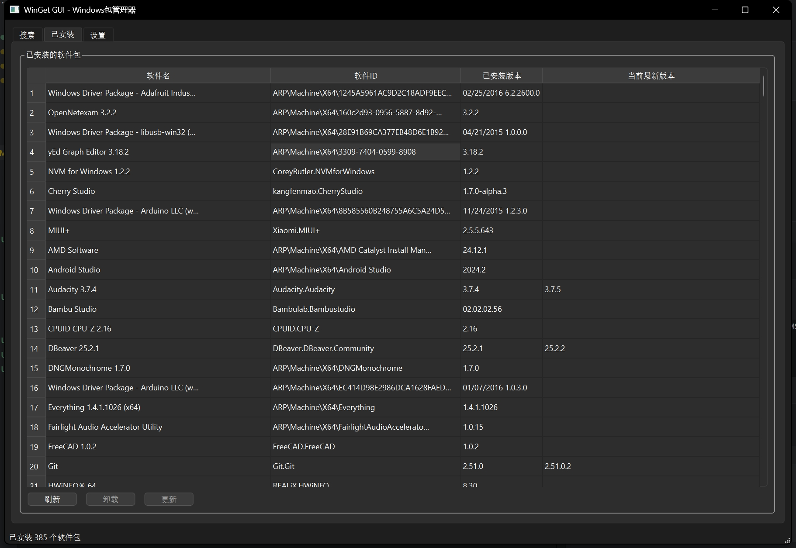
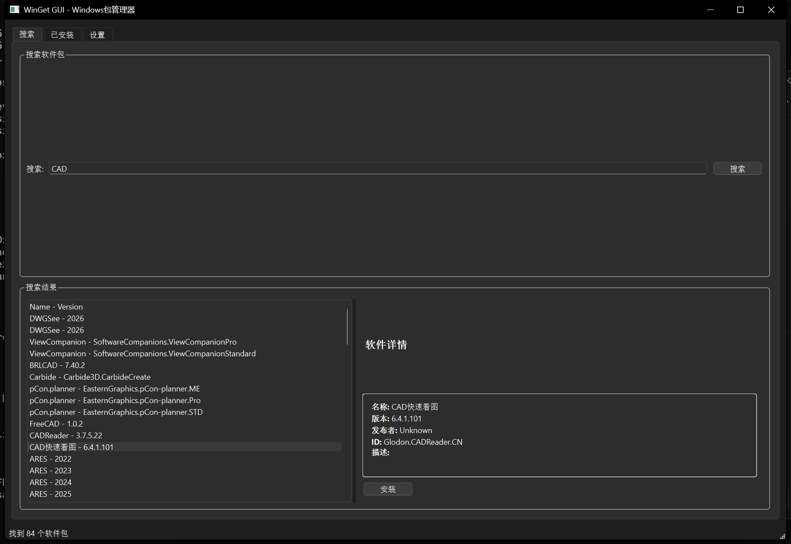
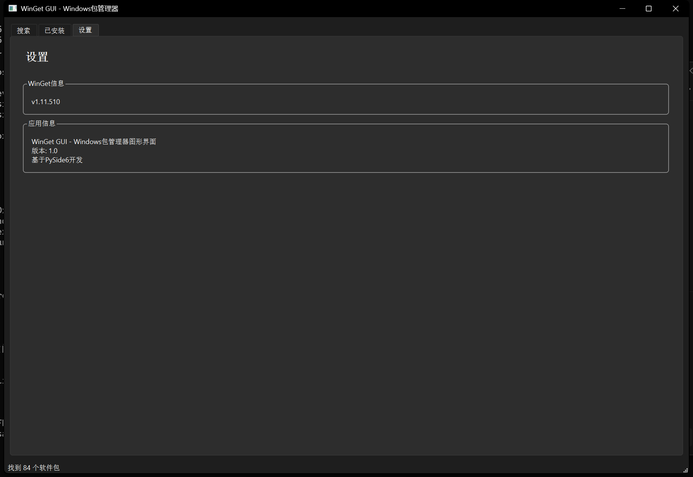

# WinGetGUI: 基于自动语义解析思想实现的PySide6框架的Windows包管理器软件

版本号：1.0.0


Windows包管理器(winget)的图形用户界面，基于PySide6开发。该工具为Windows上的软件包管理提供了类似AppStore的体验。

## 功能特性

- **搜索软件包**：轻松搜索winget仓库中可用的软件包
- **安装软件包**：一键安装软件
- **查看已安装软件包**：以表格形式查看所有已安装的软件包
- **卸载软件包**：通过图形界面卸载软件
- **更新软件包**：将软件更新到最新版本
- **软件包详情**：查看每个软件包的详细信息

## 系统要求

- Windows 10/11
- 已安装Windows包管理器(winget)
- Python 3.7 或更高版本
- PySide6

## 安装

1. 克隆仓库：
   ```bash
   git clone https://github.com/EasyCam/WinGetGUI.git
   cd WinGetGUI
   ```

2. 安装依赖：
   ```bash
   pip install -r requirements.txt
   ```

3. 运行应用程序：
   ```bash
   cd wingetgui
   briefcase run
   ```

## 使用方法

1. 启动应用程序
2. 使用"搜索"选项卡查找软件包
3. 选择一个软件包查看其详细信息
4. 点击"安装"按钮安装所选软件包
5. 使用"已安装"选项卡管理已安装的软件包
6. 刷新已安装软件包列表以查看更新

## 截图

### 已安装软件包视图


### 搜索软件包视图


### 软件包信息视图


## 许可证

本项目采用GNU通用公共许可证v3.0 - 详见[LICENSE](LICENSE)文件。

## 致谢

- 本项目使用[Briefcase](https://github.com/beeware/briefcase)生成 - [The BeeWare Project](https://beeware.org/)的一部分
- 使用[PySide6](https://wiki.qt.io/Qt_for_Python)构建
